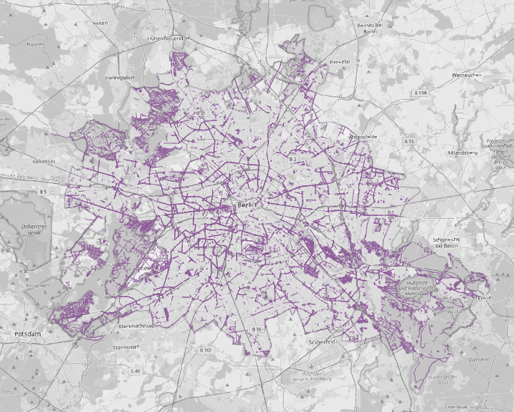

# vicumpy

## Overview

vicumpy is a Python CLI tool that extracts street networks from OpenStreetMap and exports them as GeoPackages.
The project started as a tightly coupled legacy script and was refactored into a clean, extensible architecture with explicit use cases, isolated infrastructure, and a pluggable AI-based intent parser.
The design allows natural language input (e.g. “bike and pedestrian streets in Berlin”) to be translated into structured Overpass queries without modifying core logic.

## Architecture

The architecture follows a simple dependency direction: CLI → AI Intent Parser → Use Case → Infrastructure.
All external concerns are isolated, allowing the core application flow to remain stable while new features (e.g. AI-based input) are added.

## Example Usage

Das folgende Beispielbild zeigt ein generiertes Straßennetz, wie es nach dem Export in einem GIS‑Tool dargestellt werden kann:

## Design Decisions
## Future Work

